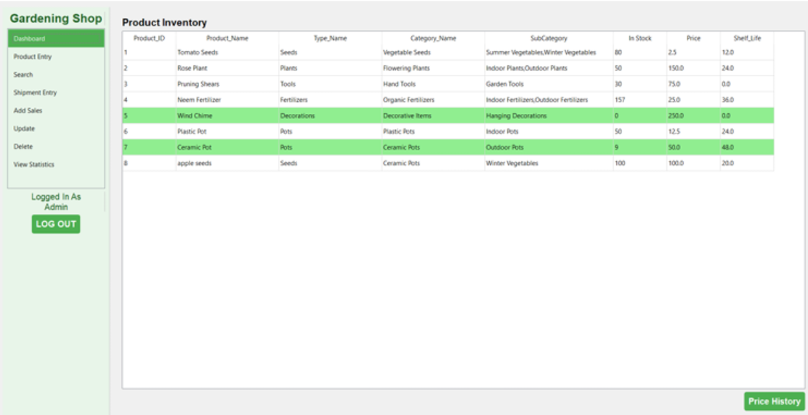
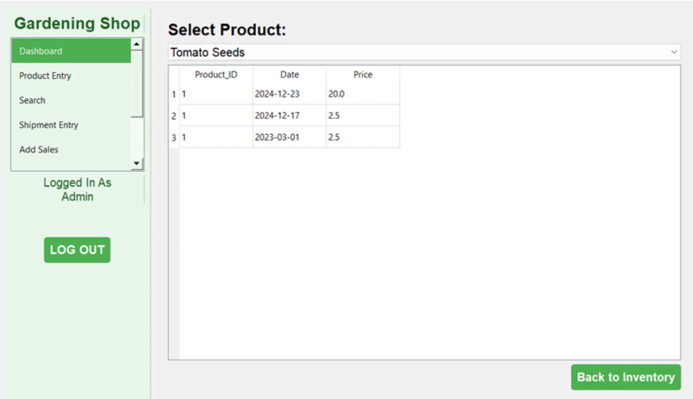
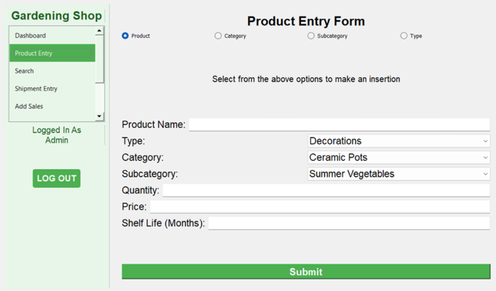
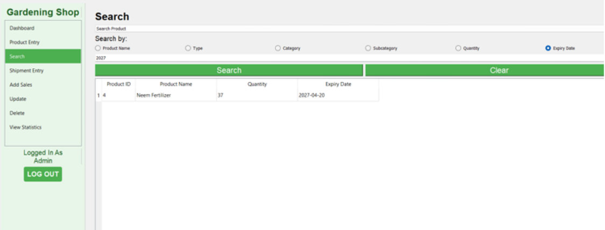
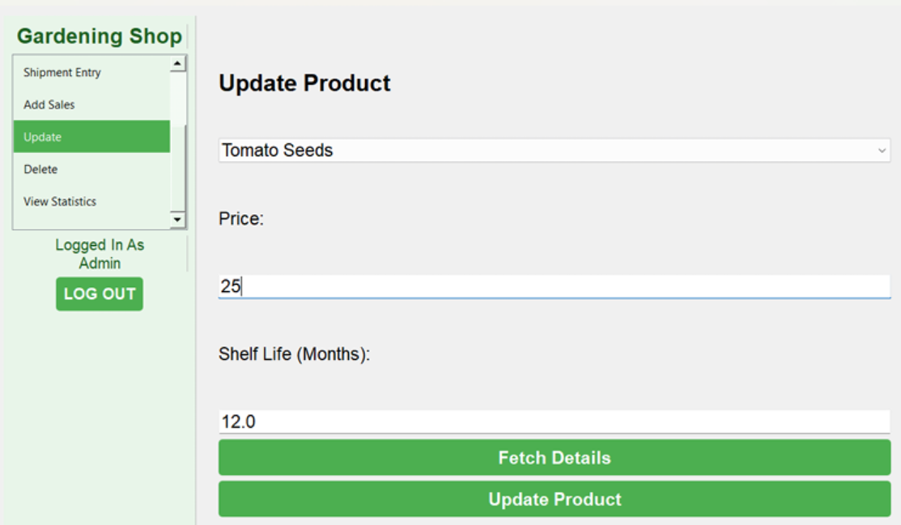
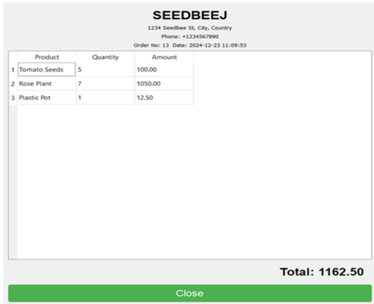
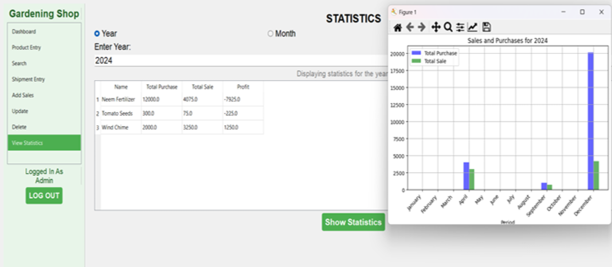

# Gardening-Shop
A real-time database management system for a gardening shop, built with Python (PyQt5 for GUI) and SQL Server. It tracks daily, monthly, and yearly sales, and provides insights into product data and performance.

### SYSTEM OVERVIEW:
This system manages the operations of a gardening shop, including handling product data, sales tracking, and basic CRUD operations.

### HOW TO RUN:
1. Ensure that you have **Python**, **PyQt5**, and **SQL Server** set up on your system.
2. Clone the repository and run the provided **SQL file** to set up the database.
3. In the `.py` files, replace the database credentials with your own.
4. Execute the `main.py` file to launch the application.

### CODE SNIPPETS:
Below are some snippets from the running code that showcase the GUI components:

#### **Login Page:**

#### **Product Inventory:**

#### **Check Price Histories of Products:**

#### **Add Product to Inventory:**

#### **Search for Product:**

#### **Update Product:**

#### **Generated Receipt:**

#### **Statistics:**

