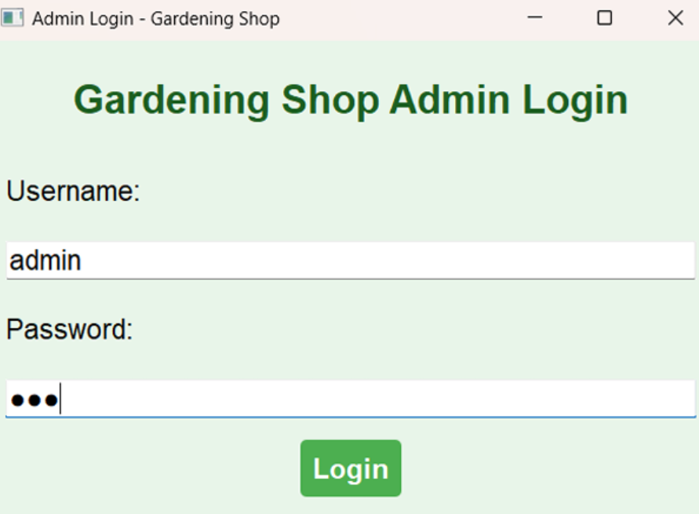

# Gardening-Shop
A real-time database management system for a gardening shop, built with Python (PyQt5 for GUI) and SQL Server. It tracks daily, monthly, and yearly sales, and provides insights into product data and performance.
SYSTEM OVERVIEW:
This system manages the operations of a gardening shop, including handling product data, sales tracking, and basic CRUD operations.

HOW TO RUN:
Ensure that you have Python, PyQt5, and SQL Server set up on your system.
Clone the repository and run the provided SQL file to set up the database.
In the .py files, replace the database credentials with your own.
Execute the main.py file to launch the application.

CODE SNIPPITS:
Below are some snippets from the running code that showcase the GUI components:
Login Page:

Product Inventory:

Check Price Histories of Products:

Add Product to Inventory:

Search for Product:

Update Product :

Generated Reciept :

Statistics:

